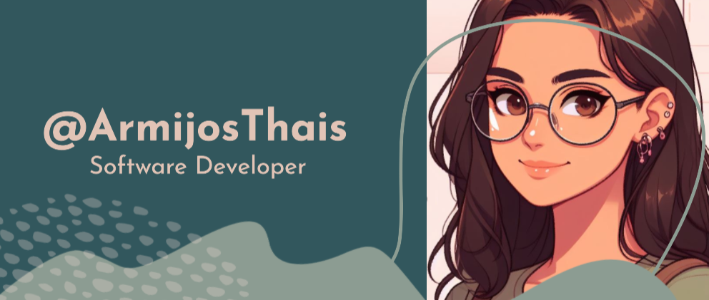

<!--
**ArmijosThais/ArmijosThais** is a ✨ _special_ ✨ repository because its `README.md` (this file) appears on your GitHub profile.

Here are some ideas to get you started:

- 🔭 I’m currently working on ...
- 🌱 I’m currently learning ...
- 👯 I’m looking to collaborate on ...
- 🤔 I’m looking for help with ...
- 💬 Ask me about ...
- 📫 How to reach me: ...
- 😄 Pronouns: ...
- ⚡ Fun fact: ...

FALTA: PORTADA Y REDES SOCIALES

-->

<h1 align="center">Hi there, I'm <a href="">Thais</a> 👋</h1>

## About Me
Passionate software developer with expertise across diverse technologies ⚡, ranging from database management to crafting engaging user interfaces 😄.

- 🚀 Focused on Frontend development with React, Angular, and Ionic. Mobile app development using React Native and Kotlin for Android.
- 💡 Skilled in databases like MySQL, MongoDB, Firebase, PostgreSQL, Oracle, and SQL Server.
- 🔧 Proficient in Backend development with Node.js, Python, and frameworks such as Express.js.
- 💬 Enthusiastic about programming and design, adept at utilizing Figma, Adobe XD for UI/UX development.

## Skills
- **Programming Languages**: JavaScript, TypeScript, Java, Kotlin, Python, MATLAB, C#, HTML, CSS, PHP. 🚀
- **Frameworks & Technologies**: React, Angular, Ionic, React Native, Node.js, .NET (Visual Studio), NetBeans. 🔧
- **Databases**: MySQL, MongoDB, Firebase, PostgreSQL, Oracle, SQL Server. 💡
- **Design Tools**: Figma, Adobe XD. 🎨

## Education🎓
- **Software Engineering Degree** - Technical University of Ambato (Graduated in 2024) 

## Featured Projects
<table>
<tr>
<td width="50%">
  <h3 align="center">Web Application for Clinical Laboratory (FrontEnd)</h3>
  

    
    

      
    

    
Developing a <strong>Web Application for a Clinical Laboratory's Frontend</strong> - This project involves creating an interface for a laboratory's web application. It includes functionalities and design elements catered specifically for the clinical setting.

  
                
</td>

<td width="50%">
   
  <h3 align="center">Facial Recognition in Python</h3>
  

    
     
    

      
    

    
Creación de un sistema de reconocimiento facial en tiempo real usando SVM en Python: este proyecto está diseñado para reconocer rostros previamente entrenados en varias posiciones y orientaciones usando la cámara de la computadora. 

  
   
</td>                                                     
</table>   

### ⚙️ &nbsp;GitHub Analytics

I love connecting with other enthusiasts in programming and design! Feel free to reach out to discuss ideas, collaborations, or simply chat about web, mobile, and technology.
